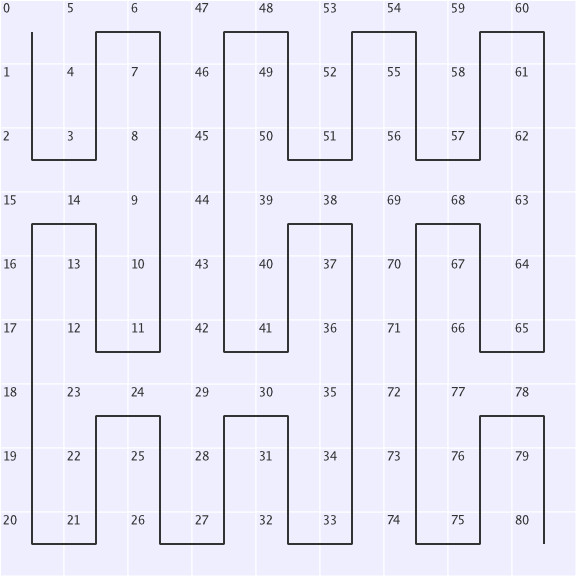
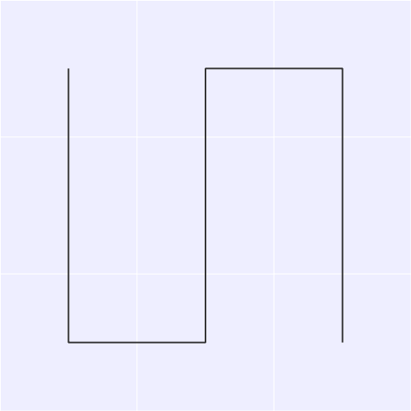

# Hilbert [](https://travis-ci.org/google/hilbert) [](https://coveralls.io/github/google/hilbert) [](https://goreportcard.com/report/github.com/google/hilbert) [](https://godoc.org/github.com/google/hilbert)

Go package for mapping values to and from space-filling curves, such as
[Hilbert](https://en.wikipedia.org/wiki/Hilbert_curve) and [Peano](https://en.wikipedia.org/wiki/Peano_curve) curves.


[Documentation available here](https://godoc.org/github.com/google/hilbert)

*This is not an official Google product (experimental or otherwise), it is just code that happens to be owned by Google.*
 
## How to use

Install:

```bash
go get github.com/google/hilbert
```

Example:

```go
package main

import (
    "github.com/dsoprea/hilbert"
)

func main() {
    // Create a Hilbert curve for mapping to and from a 16 by 16 space.
    //s, err := hilbert.NewHilbert64(16)
    s, err := hilbert.NewHilbert(16)
    if err != nil {
        panic(err)
    }

    // Create a Peano curve for mapping to and from a 27 by 27 space.
    //s, err := hilbert.NewPeano64(27)
    //s, err := hilbert.NewPeano(27)

    t := 112

    // Now map one dimension numbers in the range [0, N*N-1], to an x,y
    // coordinate on the curve where both x and y are in the range [0, N-1].
    x, y, err := s.Map(t)
    if err != nil {
        panic(err)
    }

    // (x, y) <= (7, 11)

    // Also map back from (x,y) to t.
    t, err = s.MapInverse(x, y)
    if err != nil {
        panic(err)
    }
}
```

## Demo

The demo directory contains an example on how to draw an images of Hilbert and Peano curves, as well
as animations of varying sizes for both.

```bash
go run $GOPATH/src/github.com/google/hilbert/demo/demo.go
```

and the following images are generated. 

Simple 8x8 Hibert curve:


Simple 9x9 Peano curve:



Animation of Hibert curve with N in the range 1..8:


Animation of Peano curve with N in the range 1..6:



## Licence (Apache 2)

```
Copyright 2015 Google Inc. All Rights Reserved.

Licensed under the Apache License, Version 2.0 (the "License");
you may not use this file except in compliance with the License.
You may obtain a copy of the License at

http://www.apache.org/licenses/LICENSE-2.0

Unless required by applicable law or agreed to in writing, software
distributed under the License is distributed on an "AS IS" BASIS,
WITHOUT WARRANTIES OR CONDITIONS OF ANY KIND, either express or implied.
See the License for the specific language governing permissions and
limitations under the License.
```
